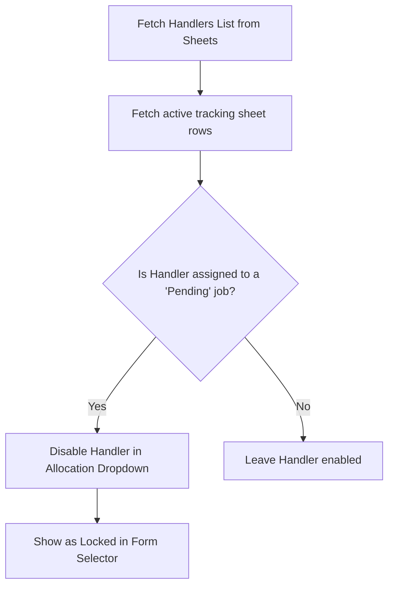

# Application Logic & Workflow

This document explains the internal mechanisms, business rules, and UI scripts that power the APAR Sample Evaluation Monitoring System.

---

## 1. Authentication & API Connection

The application connects to Google Sheets using the Google APIs Client Library:
* **Function**: `get_sheets_service()`
* **Process**:
  1. Checks if `credentials.json` exists in the project root.
  2. Loads service account credentials with the scope `https://www.googleapis.com/auth/spreadsheets` (read/write) and `https://www.googleapis.com/auth/drive.readonly` (read-only drive access).
  3. Returns a thread-safe client instance pointing to the Google Sheets spreadsheet engine (`spreadsheets().values()`).

---

## 2. Target Deadline Arithmetic

When a sample is registered, a target deadline is calculated relative to the **Date of Issue** and the **Issue Type**.

### Priority Profiles
| Issue Type | Resolution Timeframe | Deadline Calculation |
|---|---|---|
| **Condition Monitoring** | Standard (7 Days) | `Issue Date + 7 Days` |
| **Complain Handling** | Urgent (3 Days) | `Issue Date + 3 Days` |
| **Product Benchmarking** | Normal (10 Days) | `Issue Date + 10 Days` |

### Synchronization Mechanism
* **Frontend (`form.html`)**: Written in JavaScript. As soon as the user selects an Issue Type or modifies the Date of Issue, the `updateDeadline()` listener automatically updates the visual target deadline box (`#deadline_date`) in `dd-mm-yyyy` format.
* **Backend (`app.py`)**: Written in Python. The function `calculate_deadline()` recalculates the target date during the POST request to prevent any client-side template tampering and to ensure data integrity before syncing to Google Sheets.

---

## 3. Dynamic Handler Locking (Task Overload Prevention)

To prevent handlers from being overwhelmed with too many tasks, the system implements a dynamic locking mechanism:

### Technical Workflow
1. The backend scans column C (Allocated Handler) and column O (Status) of the `Evaluation Data Rowwise` sheet.
2. If any handler has a record where the status is precisely `"Pending"`, they are flagged.
3. When the web form is rendered, the template loops through the master list of handlers.
4. Any flagged handler gets marked as `disabled` in the HTML select dropdown and appended with the text `(Locked)` so they cannot be selected for new tasks.
5. The handler is automatically unlocked as soon as all their pending tasks are marked as `Done`.

---

## 4. Alarm & Alert Timeline Engine

The alarm system keeps tracking all pending tasks and alerts the operations team when deadline limits are reached.

### Detection Window (`check_upcoming_alarms`)
The alarm system scans the live sheets matrix for incomplete tasks (`Status != 'Done'`) whose deadlines fall within a 3-day warning window:
* **Critical (Due Today)**: `Deadline == Today`
* **Urgent (1 Day Remaining)**: `Deadline == Today + 1 Day`
* **Warning (2 Days Remaining)**: `Deadline == Today + 2 Days`

### Web Audio & Visual Alert Flow
1. If there is at least one active alarm in the alert list, an alarm banner appears at the top of the dashboard.
2. **Programmatic Wind Chime Synthesis**: The browser programmatically synthesizes a series of pleasant, overlapping wind chime notes using the Web Audio API (specifically constructing a C Major Pentatonic scale). This avoids any dependency on external static audio files.
3. **Autoplay Bypass**: Modern browsers block programmatic audio playback until the user interacts with the page. To bypass this, the frontend registers single-use listeners on `mousemove`, `keydown`, `click`, `touchstart`, and `scroll`. Upon the first gesture, it triggers `triggerInstantAlarm()`.
4. **Realistic Acoustic Modeling**: Each chime note is generated using a combination of sine wave oscillators set to fundamental and non-harmonic frequency ratios (simulating physical metal tubes). Individual gain envelopes dictate exponential decay (higher frequencies decay faster) for a natural, non-irritating ring-out.
5. **Continuous Organic Scheduling**: A randomized interval (1.2s to 1.8s) triggers the next chime sequence, resulting in a gentle, alerting, yet non-irritating background audio texture.
6. **Snooze System**:
   * Users can click "Snooze Alarm (5m)".
   * This cancels the scheduled chime queue, triggers a fast fade-out of active oscillators, and sets a timestamp in the browser's `localStorage` (`alarmSnoozeExpiry = Date.now() + 5 minutes`).
   * When the page loads or refreshes, the script checks if the snooze has expired. If it hasn't, the audio is suppressed.
7. **Task Resolution**:
   * Each alert row displays a **Job Done ✓** button.
   * Clicking this submits a request to `/mark_done/<id>`.
   * The backend searches for the target ID in the spreadsheet, replaces the status cell in Column O with `"Done"`, and redirects back to the main portal. This resolves the alarm and immediately halts the audio alert.
